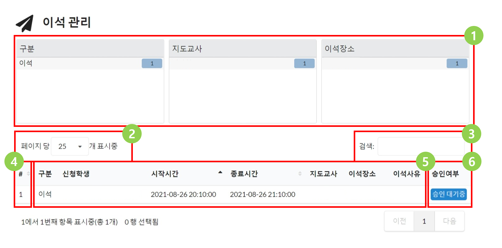

# 이석 관리

### 이석 관리 페이지

아래는 이석 관리 페이지의 기본 화면입니다.

| 번호 | 설명                                                                       |
| -- | ------------------------------------------------------------------------ |
| 1  | 이석 구분, 지도교사 이름, 이석 장소를 한눈에 볼 수 있는 패널입니다. 각 항목을 클릭하여 이석들을 필터링하여 볼 수 있습니다. |
| 2  | 한 페이지에 보여줄 이석의 개수를 조절할 수 있습니다.                                           |
| 3  | 이석에 기재된 정보를 바탕으로 이석을 검색할 수 있습니다.                                         |
| 4  | 현재 페이지를 기준으로 1부터 부여하는 이석의 번호입니다. (이석의 고유번호는 아닙니다.)                       |
| 5  | 이석의 기본 기재 정보입니다.                                                         |
| 6  | 이석 승인여부입니다.                                                              |

### 이석 승인 여부

각 이석은 `승인여부`를 가집니다. 승인여부는 1단계\~5단계로 구분되며 `전역설정`에서 각 이석의 최종 승인에 필요한 단계 수를 조절할 수 있습니다.

만약 3단계의 절차로 이석을 승인하도록 `전역설정`에서 설정하였다면, 이석이 가질 수 있는 이석 상태와 그에 해당하는 승인여부 표시는 아래와 같습니다.

.png>)

### 이석 승인 및 거절하기

이석을 승인하거나 거절할 권한을 가지고 있는 모든 역할의 사용자들은 승인여부 표시를 클릭할 경우 아래와 같은 창이 표시됩니다.

.png>)

만약 `전역설정`에서 2단계 승인 절차를 설정했다면, 각 이석 상태에서 버튼을 클릭했을 때 변화할 수 있는 이석 상태의 경우의 수는 아래와 같습니다.

.png>)

### 이석 상태 변경 권한

이석찬의 사용자는 `역할`에 속하며 각 `역할`에는 이석 상태의 변경 권한이 주어집니다. `역할`은 각 단계의 이석 상태 변경 권한을 동시에 가질 수 있습니다. 예를 들어, 1단계 및 3단계의 이석 상태 변경 권한이 주어진 `역할`에 속한 사용자의 경우, 1단계만 승인된 이석을 승인하거나 거절할 수 없습니다. 이석 상태의 단계는 중요 순위가 없으며, 상위 단계의 권한이 하위 단계의 권한을 상속하지 않습니다. 따라서, 3단계의 권한만을 가지고 있는 사용자는 1,2 단계의 권한을 변경할 수 없습니다.

이석 상태 변경 권한을 가진 사용자는 아래와 같은 버튼을 클릭하여 선택된 모든 이석을 자신이 변경할 수 있는 최대 단계로 승인('선택된 이석 승인' 버튼)하거나 선택된 모든 이석을 삭제할 수 있습니다('선택된 이석 삭제' 버튼).&#x20;

.png>)

예를 들어, 3단계 승인 절차를 가지는 상황에서 1,3 단계의 승인 권한을 가지는 A와 2단계의 승인 권한을 가지는 B가 있다고 가정해보겠습니다.현재 어떤 단계도 승인되거나 거절되지 않은 미승인 상태의 이석을 A가 최대 단계로 승인하고자 한다면, A는 2단계의 승인 권한을 가지고 있지 않으므로 1단계가 변경할 수 있는 최대 단계가 됩니다. 그러나 만약, 1,2 단계가 모두 승인된 상태의 이석을 A가 최대 단계로 승인하고자 한다면 이 이석은 3단계로 승인이 될 것입니다. 반대로, 미승인 상태의 이석을 B가 최대 단계로 승인하고자 한다면 이석의 승인 상태는 변하지 않으며, 1단계만 승인 상태인 이석을 B가 최대 단계로 승인하고자 한다면 2단계 승인 상태의 이석이 될 것 입니다.

&#x20;
